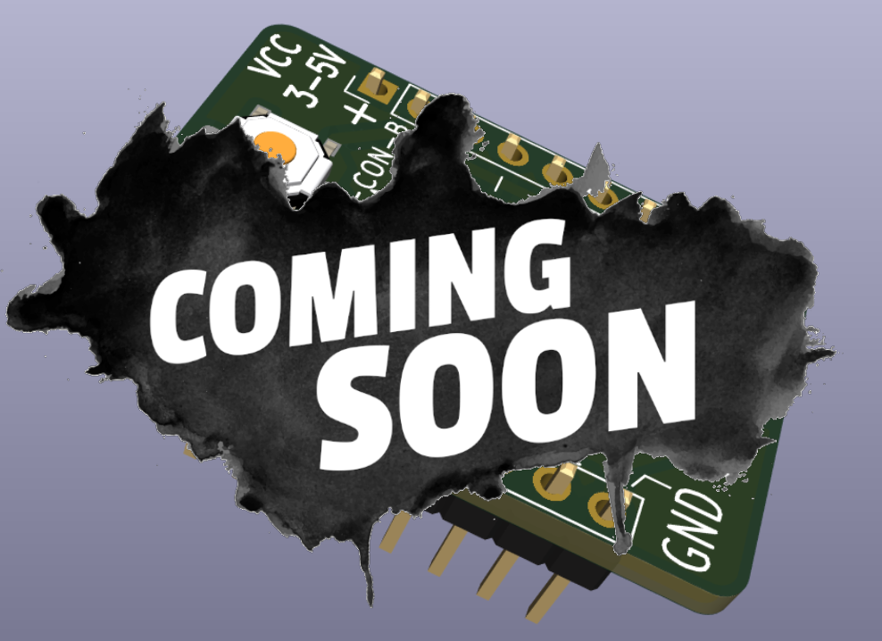

# The LED Switch Breakout board

## Breadboard microcontroller projects 

Prototyping microcontrollers on a breadboard or any similar setup is very common. The `LED Switch Breakout` board quickly verifies GPIO outputs or code behavior when the input changes. No need to grab a bunch of LEDs, resistors, or switches. Just use this board.

## Board main features

The fully assembled board includes:

- One switch to close a circuit (max 50 mA).
- One switch to pull down GPIO input to the ground via a 10 kOhm resistor.
- Four colored (red, yellow, green, and blue) LEDs indicate the GPIO output state.
- Pin spacing is 0.1" to fit a standard breadboard.
- The width of the board between pin rows is 0.7".
- Power with 3-5V is only required when using the pull-down switch.

## Example usage

The Arduino library [LedTask](https://github.com/berrak/LedTask) on GitHub shows an example using this board (v1.0). `LedTask` offers an elementary `multi-tasking` example with four LEDs, and these run close to independent of each other.

## Specification for the LED Switch Breakout board v1.1

The fabricated two-layer board size is 20.8 x 31.0 mm (0.82"x1.22").

| parameter | imperial | metric |
| -----------|-------|------|
| board material | FR4 | FR4 |
| board thickness | 39 mil | 1.0 mm |
| surface finish | HASL | HASL |
| copper layer thickness | 1.4 mil | 35 um |
| board color | black | black |
| board text | white | white |
| board weight | 2.82 oz | 80 gram |

Printed circuit boards use Hot air solder leveling (*HASL*).

## The board is fully assembled and tested

The `LED Switch Breakout` board is available only fully assembled.

## Purchase the board
`Tindie` has all the latest designed boards.

I appreciate your support.

## Credits

`Coming soon` splash image by [starline](https://www.freepik.com/free-vector/abstract-grunge-style-coming-soon-with-black-splatter_9504688.htm#query=coming%20soon&position=4&from_view=keyword).
