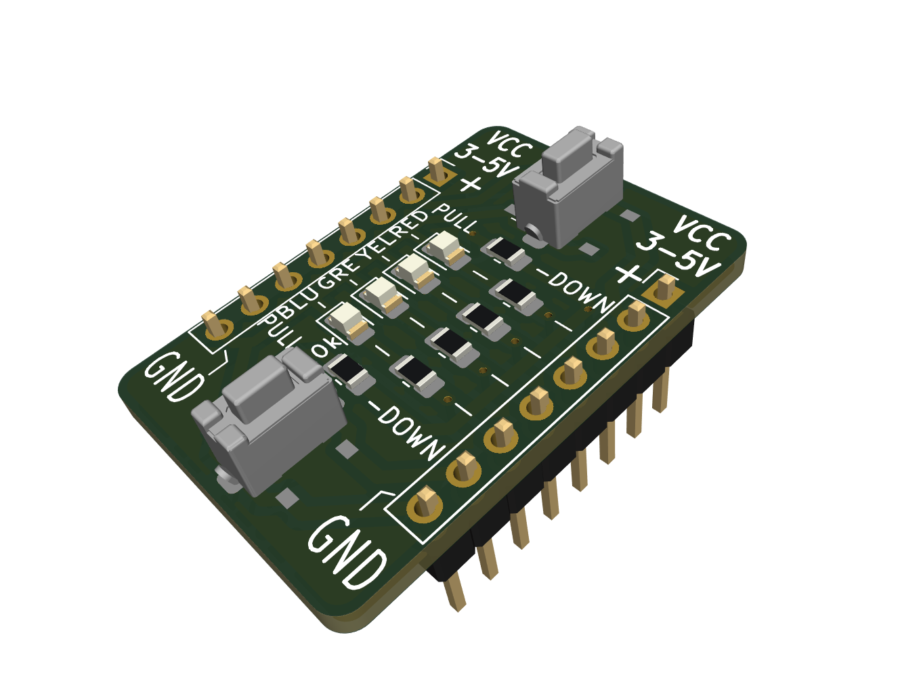
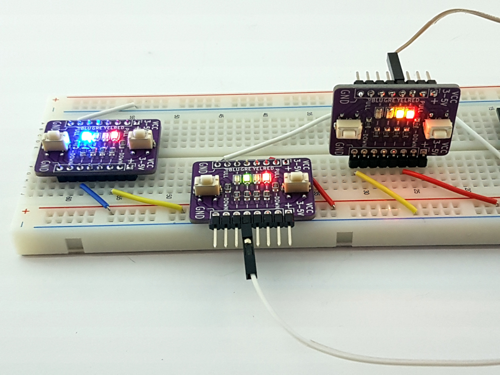

# The TinyLedSwitch - A universal breakout board

## Breadboard microcontroller projects 

Prototyping microcontrollers on a breadboard or any similar setup is very common. The `Tiny LED Switch Breakout` board quickly verifies GPIO outputs or code behavior when the input changes. No need to grab a bunch of LEDs, resistors, or switches. Just use this board.

Seeing the logic state of different buttons, switches, and data lines is beneficial. With the `TinyLedSwitch Breakout Board`, it is easy to identify the source of a problem, whether it be a bad switch, wire, or code.

## Board main features

The fully assembled board includes:

- Two switches to pull down GPIO input to the ground via a 10 kOhm resistor.
- Four colored (red, yellow, green, and blue) LEDs indicate the GPIO output state.
- Pin spacing is 0.1" to fit a standard breadboard.
- The width of the board between pin rows is 0.7".
- Power with 3-5V is only required when using the pull-down switch.

## Example usage

The Arduino library [LedTask](https://github.com/berrak/LedTask) on GitHub shows an example using this board (v1.1). `LedTask` offers an elementary `multi-tasking` example with four LEDs, and these run close to independent of each other, and in addition a switch example sketch.

## Specification for the breakout board v1.1

* Operating voltage (optionally for the pull-down switches): 3.3-5V.
* The board size is 20.8 x 31.0 mm (0.82"x1.22") and fabricated as a two-layer board.
* Board thickness: 1.6 mm (63 mils).
* Color: Purple
* Weight: 3 grams (0.11 ounce).
* Height: 15 mm (0.59").

## Purchase the board.

`The TinyLedSwitch - A universal breakout board` is available fully assembled in two header pin variants but can be ordered without soldered header pins.

[Tindie](https://www.tindie.com/products/28755/) and [Lectronz](https://lectronz.com/products/the-tinyledswitch-a-universal-breakout-board) have all the purchasing details.

 

I appreciate your support.
